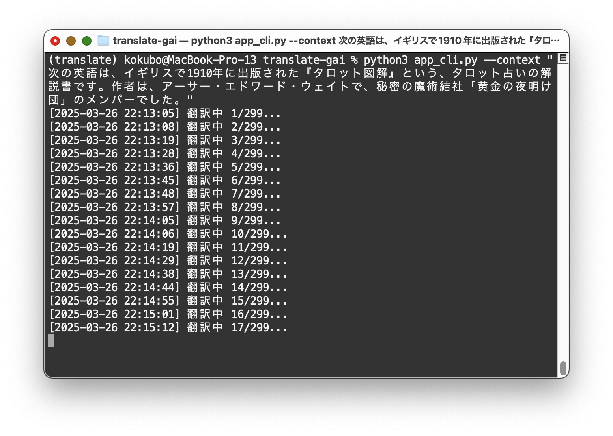

# 生成AI翻訳

## 使用したもの
 - LangChain
 - [Ollama](https://ollama.com/)

## インストール
```
git clone https://github.com/akokubo/translate_gai.git
cd translate_gai
python3 -m venv venv
source venv/bin/activate
python3 -m pip install --upgrade pip
python3 -m pip install -r requirements.txt
```

## Ollamaの準備

## Ollamaの準備
1. Ollamaをインストール
   - Windowsの場合は、WSL2で仮想環境から `curl -fsSL https://ollama.com/install.sh | sh` でインストール
   - Macの場合は、[ダウンロード](https://ollama.com/download/windows)してインストール
2. Ollamaで大規模言語モデルの `gemma3` をpullする。
```
ollama pull gemma3
```
※大規模言語モデルは、自由に選べ、他のものでもいい。

## 実行
最初に、プログラムを展開したフォルダに入る。
次に仮想環境に入っていない場合(コマンドプロンプトに(venv)と表示されていないとき)、仮想環境に入る。
```
source venv/bin/activate
```

Ollamaが起動していないかもしれないので、仮想環境に入っている状態で、大規模言語モデルのリストを表示する(すると起動していなければ、起動する)。
```
ollama list
```

仮想環境に入っている状態で、以下のコマンドで実行する。

### CLI版
```
python3 app_cli.py --input 原文のテキストファイル --output 翻訳を出力するテキストファイル --context "ここに文脈情報"
```
※文脈情報とは、たとえばいつ、どこで、誰が書いた、どういう文書かなどです。

例: この文章は、イギリスで1895年に出版された『亀がアキレスに言ったこと』という、数学を題材にしてナンセンス小説です。作者は、『不思議の国のアリス』で有名なルイス・キャロルです。



### GUI版
注・安定していないので、CLI版を推奨します。

```
python3 -m streamlit run app.py
```

## 作者
[小久保 温(こくぼ・あつし)](https://akokubo.github.io/)

## ライセンス
[MIT License](LICENSE)
